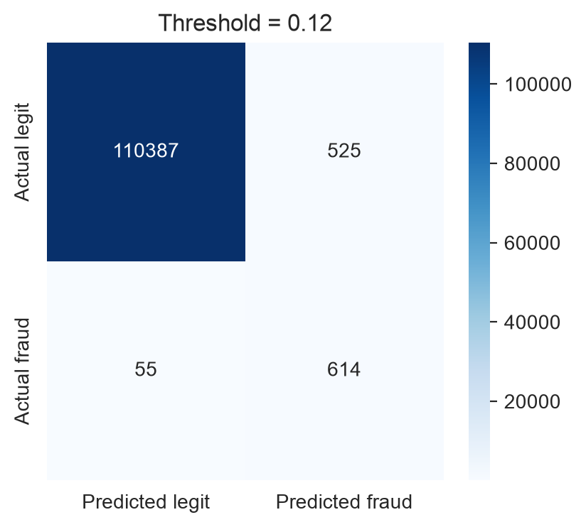
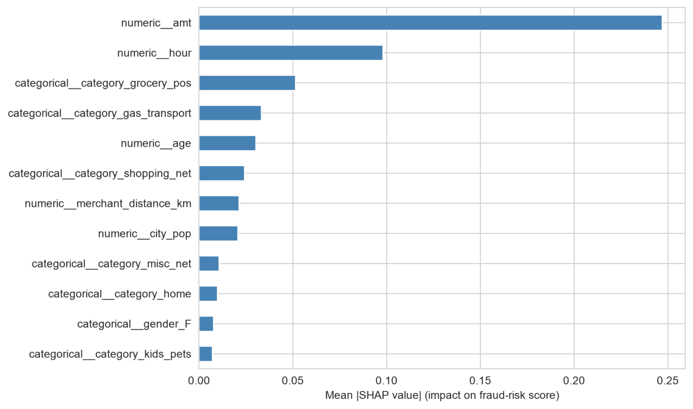
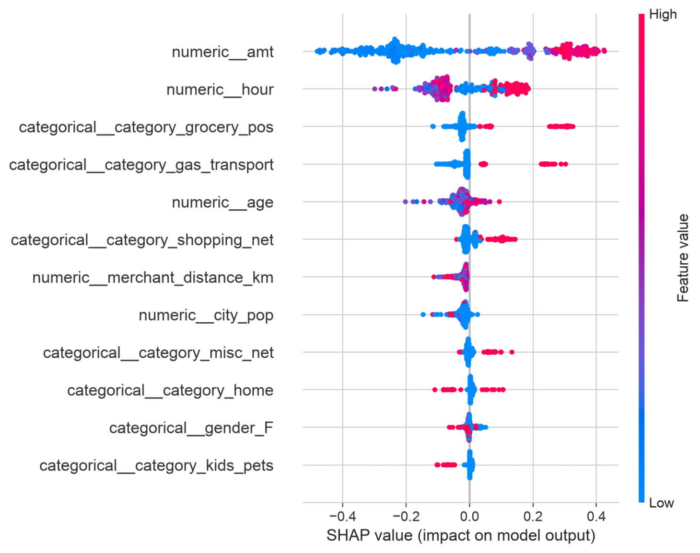
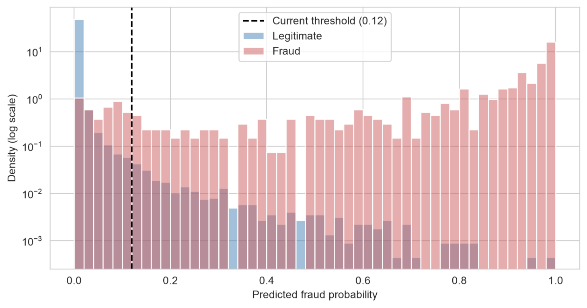
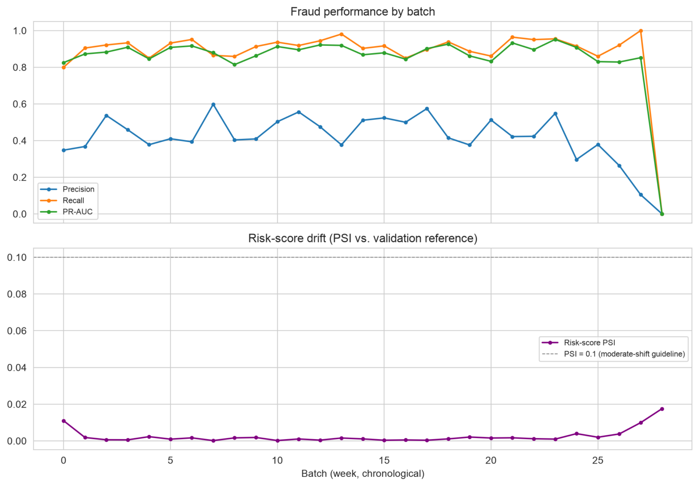

# Credit Card Fraud Detection & Risk Monitoring System

## Problem

Fraud is rare — well under 1% of transactions — which makes overall accuracy a
misleading measure of model quality. A classifier that predicts "legitimate"
for every single transaction in this dataset scores **99.42% accuracy** while
catching **zero fraud**. The real operational objective is to maximize fraud
capture while controlling:

- False positives (legitimate customers wrongly flagged)
- Investigator review volume (alerts must fit within realistic capacity)
- The tradeoff between the two, at an explicitly chosen operating point —
  not a default 0.5 threshold picked by accident

This project treats fraud detection as an **operational decision problem**,
not just a classification problem: model choice, decision thresholds, false
positives, investigator capacity, explainability, and monitoring all have to
work together for a fraud system to be genuinely useful.

## Dataset

- **Source:** [Kaggle — Credit Card Transactions Fraud Detection Dataset](https://www.kaggle.com/datasets/kartik2112/fraud-detection) (`fraudTrain.csv` / `fraudTest.csv`), a Sparkov-simulated dataset of synthetic cardholders and merchants with injected fraud.
- **Size:** 1,296,675 training transactions + 555,719 test transactions (1,852,394 total).
- **Fraud prevalence:** 0.579% in train, 0.386% in test (~1:173 to ~1:259 imbalance).
- **Time period:** 2019-01-01 through 2020-12-31. `fraudTest.csv` is not a random sample — it's Kaggle's own temporal continuation of `fraudTrain.csv`, picking up exactly where training data ends.
- **Features:** transaction amount, merchant category, cardholder demographics (age, gender, job, city population), cardholder and merchant geolocation, and timestamps. Unlike the classic anonymized `V1`–`V28` PCA fraud dataset, every feature here is genuinely interpretable.
- **Important limitation:** this is a *simulated* dataset. The fraud label reflects the simulator's own fraud-injection logic, not real-world chargebacks or investigator confirmations — see [Limitations](#limitations).

### Why this dataset, not the original

This repository originally used the classic anonymized ULB/Kaggle dataset
(`V1`–`V28` PCA features). That dataset could not be recovered (never
committed, though still available at
[kaggle.com/datasets/mlg-ulb/creditcardfraud](https://www.kaggle.com/datasets/mlg-ulb/creditcardfraud)),
and the original pipeline had a real bug: SMOTE was applied in a way that
leaked information into evaluation, producing "perfect" Decision Tree scores
that were actually overfitting. Rather than resurrect a flawed baseline, this
project was rebuilt from scratch on a richer dataset — one whose interpretable
features unlock fraud rules and genuine explainability that anonymized PCA
components structurally cannot support. The original notebook, results, and a
detailed rationale are preserved in [`archive/old-2019-repo/`](archive/old-2019-repo/).

## Methodology

```
Data Audit → Split → Baseline → Model Comparison → Threshold Optimization
→ Risk Ranking → Error Analysis → Explainability → Fraud Rules → Monitoring
```

- **Split:** `fraudTest.csv` is held out untouched until final evaluation. Validation is the last 6 weeks of `fraudTrain.csv` (2020-05-10 to 2020-06-21, 111,581 transactions); everything before that is training data (1,185,094 transactions).
- **Preprocessing:** row-local feature engineering (hour, day-of-week, age from date of birth, haversine distance between cardholder and merchant) plus a `ColumnTransformer` (scaling + one-hot encoding) fit only on the training split.
- **Imbalance handling:** compared empirically, not assumed. For Logistic Regression, class weighting and SMOTE (train-only, 10% target) barely moved PR-AUC (0.263 untouched vs. 0.183 class-weighted vs. 0.255 SMOTE) — the real effect was on threshold calibration, not ranking quality.

Full analysis lives in [`notebooks/`](notebooks/):
[`01_eda.ipynb`](notebooks/01_eda.ipynb) ·
[`02_modeling.ipynb`](notebooks/02_modeling.ipynb) ·
[`03_threshold_analysis.ipynb`](notebooks/03_threshold_analysis.ipynb) ·
[`04_error_analysis.ipynb`](notebooks/04_error_analysis.ipynb) (also covers explainability, fraud rules, and monitoring).

## Model Comparison

Evaluated on the validation split, class weighting applied to all three:

| Model | PR-AUC | ROC-AUC | Precision | Recall | F1 | FPR |
|---|---|---|---|---|---|---|
| Logistic Regression | 0.183 | 0.912 | 0.037 | 0.755 | 0.070 | 0.1190 |
| **Random Forest** | **0.913** | 0.992 | 0.908 | 0.837 | **0.871** | 0.0005 |
| XGBoost | 0.915 | **0.999** | 0.434 | 0.948 | 0.595 | 0.0075 |

Logistic Regression is decisively out. Random Forest and XGBoost are close —
threshold analysis (below) was used to make the final call rather than PR-AUC
alone.

## Selected Operating Point

Threshold chosen via **Option A: maximize recall subject to False Positive
Rate ≤ 0.5%**:

| Model | Threshold | Precision | Recall | FPR | Alerts |
|---|---|---|---|---|---|
| **Random Forest (selected)** | **0.12** | 0.539 | 0.918 | 0.0047 | 1,139 (1.02% of transactions) |
| XGBoost (alternative) | 0.68 | 0.530 | 0.931 | 0.0050 | 1,175 (1.05% of transactions) |

At this operating point the two models are close enough to call a tie.
**Random Forest was carried forward**: its threshold (0.12) sits in a flatter,
less sensitive part of its precision/recall curve than XGBoost's (0.68, near
the steep top end), and it's simpler to explain to investigators and via SHAP.
XGBoost remains a documented, nearly-tied alternative — this was a close call,
not a decisive win.

> At threshold 0.12, the model captures **91.8%** of fraudulent transactions
> while flagging only **1.02%** of legitimate transactions for review.



*614 true positives, 525 false positives, 55 false negatives, 110,387 true negatives — pulled live from the Threshold Simulator page of the dashboard, which redraws this at whatever threshold the slider is set to.*

## Investigator Capacity

Ranking transactions by risk score (rather than a fixed threshold) concentrates
fraud sharply:

| Review capacity | Fraud captured | Precision@K | Recall@K |
|---|---|---|---|
| Top 0.5% | 530 / 669 | 94.98% | 79.22% |
| Top 1% | 614 / 669 | 55.02% | 91.78% |
| Top 2% | 648 / 669 | 29.03% | 96.86% |
| Top 5% | 658 / 669 | 11.79% | 98.36% |

> Reviewing the highest-risk **0.5%** of transactions captures **79%** of
> observed fraud at **95%** precision. An investigator team limited to
> reviewing just **1%** of transaction volume would still catch **over 90%**
> of fraud — the practical bottleneck is review capacity, not model quality.

## False-Positive Analysis

- **False positives are genuinely high-value**: mean $367 (median $112) vs.
  $66 for true negatives — confirmed by measurement, not assumed.
- **FP rate concentrates in card-not-present categories** (`grocery_net` 0.86%,
  `shopping_net` 0.74%, `misc_net` 0.73%) — the same categories that carry the
  most real fraud signal, per the EDA. The model isn't wrong to weight these
  categories heavily; it's imprecise about which specific transaction within
  them is fraud.
- **The model's real blind spot is low-amount fraud.** Missed fraud (false
  negatives) averages **$94** vs. **$584** for caught fraud. In three
  categories — `kids_pets`, `personal_care`, `travel` — the model actually
  **misses more fraud than it catches**. SHAP confirms this at the individual
  level: a $145.21 missed fraud case scored only 0.11, with amount itself
  being the single largest reason it wasn't flagged (SHAP contribution −0.25).
- **Geographic distance carries no signal on this dataset** — confirmed three
  independent ways: no separation in the raw EDA distributions, near-bottom
  SHAP importance (0.021, vs. amount's 0.247), and a standalone
  geographic-anomaly rule that performs *worse than the base fraud rate*
  (0.65% precision vs. 0.58% baseline). Real-world card-not-present fraud
  often shows geographic anomalies; this simulator doesn't encode that pattern.

### Fraud rules, tested empirically

| Rule | Precision | Recall |
|---|---|---|
| Unusual amount for this cardholder (z > 3) | **20.8%** | 52.6% |
| Odd hour (midnight–4am) | 1.1% | 30.5% |
| Velocity (≥3 transactions/hour) | 4.8% | 18.2% |
| Geographic anomaly (>p95 distance) | 0.65% | 5.5% |

A simple per-cardholder amount rule is genuinely strong on its own — no model
needed. But OR-ing rules together to match the model's recall requires
flagging **19.64%** of all transactions (vs. the model's 1.02%) — concretely
why hand-written rules don't replace a trained ranking model. Rules do add a
little on top of the model: of the fraud cases the model misses, the four
rules together recover 29% of them, with the velocity rule (an orthogonal
signal to amount/category) recovering the most.

## Explainability

Because every feature here is genuinely interpretable — unlike the anonymized
`V1`–`V28` PCA features in the original 2019 iteration — SHAP explanations
translate directly into investigator-facing reasoning.



Amount dominates (mean |SHAP| 0.247), 2.5x the next feature (hour, 0.098).
Category indicators and age are secondary factors.



## Monitoring

The Streamlit dashboard ([`app/app.py`](app/app.py)) provides six pages:
Overview, Risk Distribution, Investigator Queue, Threshold Simulator, Model
Monitoring, and Explainability. Run it locally with:

```sh
source .venv/bin/activate
streamlit run app/app.py
```



*93.6% of risk scores are exactly 0.0 — this Random Forest's output is
heavily zero-inflated, which required fixed-tier bins (rather than quantile
bins) for meaningful drift detection.*



`fraudTest.csv` was replayed as 29 weekly batches — the **first and only**
use of the test set anywhere in this project; every prior modeling decision
used the validation split exclusively.

> On genuinely unseen future data, recall and false-positive rate hold up
> almost exactly (0.909 vs. validation's 0.918 recall; 0.0048 vs. 0.0047
> FPR), while precision degrades somewhat (0.424 vs. 0.539) — an honest
> generalization gap, not a cherry-picked result.

No meaningful drift was detected across the 6.5-month test period —
risk-score PSI stayed between 0.0002 and 0.0175, an order of magnitude under
the 0.1 "moderate shift" guideline. A real seasonal dip in fraud rate during
late December did surface in the monitoring charts as a precision dip —
exactly the kind of pattern this setup exists to catch.

## Limitations

- **Simulated data.** Labels come from a transaction simulator's fraud-injection logic, not real chargebacks, investigator confirmations, or cardholder disputes. Patterns learned here (e.g., "amount dominates, geography doesn't matter") reflect this simulator's generation process and may not transfer to real-world fraud, which is often geographically anomalous in ways this data isn't.
- **Historical, not live.** All evaluation is retrospective on a fixed 2019–2020 window; no feedback loop with real investigator outcomes exists.
- **No real investigator feedback loop.** Precision/recall are measured against the simulator's ground truth, not against what investigators would actually confirm as fraud after review.
- **No device- or session-level signal.** No IP address, device fingerprint, or session behavior data is available — features real fraud systems often rely on heavily.
- **Credit-card fraud ≠ identity fraud.** This system detects anomalous card transactions. Results should not be assumed to generalize to account takeover, stolen PII, or social-engineering fraud, which have very different behavioral signatures.
- **A known model blind spot exists**: low-amount fraud, particularly in `kids_pets`, `personal_care`, and `travel` categories, is under-detected — documented in [False-Positive Analysis](#false-positive-analysis) rather than hidden.
- **Validation-set metrics overstate real-world precision** by a measurable margin (0.539 vs. 0.424 on held-out test data) — plan for the lower number in any capacity/staffing decision, not the validation number.

## Repository Structure

```
FraudDetection/
├── README.md
├── requirements.txt
├── data/                        (not committed — see Dataset section)
├── notebooks/
│   ├── 01_eda.ipynb
│   ├── 02_modeling.ipynb
│   ├── 03_threshold_analysis.ipynb
│   └── 04_error_analysis.ipynb
├── src/
│   ├── preprocessing.py
│   ├── train.py
│   ├── evaluate.py
│   └── monitoring.py
├── app/
│   └── app.py
├── models/                      (not committed — generated by notebooks)
├── tests/
│   ├── test_preprocessing.py
│   └── test_evaluate.py
├── docs/screenshots/
└── archive/old-2019-repo/       (prior iteration, preserved for reference)
```

## Running This Project

```sh
python3 -m venv .venv
source .venv/bin/activate
pip install -r requirements.txt

# Run notebooks 01-04 in order (regenerates models/ artifacts)
jupyter notebook notebooks/

# Run the test suite
pytest

# Run the dashboard (needs models/ from the notebooks above)
streamlit run app/app.py
```
