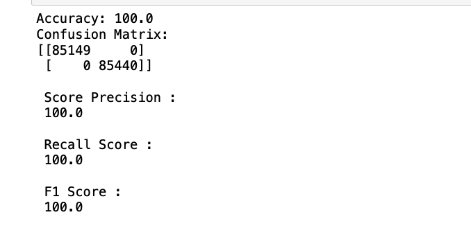

# CreditCardFraudDetection
This project demonstrates a credit card fraud detection system using a Decision Tree model. The dataset is balanced using SMOTE, and the model is evaluated using cross-validation with a Random Forest model and ROC curves.

## Project Description

Credit card fraud detection is a significant issue for financial institutions. This project aims to build a machine learning model to detect fraudulent transactions. We use a dataset from Kaggle, preprocess the data, balance it using SMOTE, and train a Decision Tree model. The model's performance is evaluated using cross-validation with a Random Forest and ROC curves.

## Dataset

The dataset used for this project is available on [Kaggle](https://www.kaggle.com/mlg-ulb/creditcardfraud). It contains transactions made by credit cards in September 2013 by European cardholders. The dataset presents transactions that occurred in two days, with 492 frauds out of 284,807 transactions.

## Installation

To install the necessary packages, run:

```sh
pip install -r requirements.txt
```

## Usage

1. Clone the repository:

    ```sh
    git clone https://github.com/your-username/CreditCardFraudDetection.git
    ```

2. Navigate to the project directory:

    ```sh
    cd CreditCardFraudDetection
    ```

3. Run the Jupyter notebook or Python scripts to train the model and make predictions:

    - Open the Jupyter notebook:

      ```sh
      jupyter notebook notebooks/credit_card_fraud_detection.ipynb
      ```
## Project Workflow

### Step 1: Data Loading and Preprocessing

- **Load the dataset**: The dataset is loaded into a Pandas DataFrame. It contains 31 features, including the 'Time' and 'Amount' features. The remaining 28 features are anonymized and labeled as 'V1', 'V2', ..., 'V28' to protect user confidentiality.
- **Data scaling**: The 'Amount' column is scaled using `StandardScaler`.

### Step 2: Data Balancing

- **Imbalance in the dataset**: Initially, the dataset is highly imbalanced, with a very low number of fraudulent transactions compared to non-fraudulent ones.
- **SMOTE**: The Synthetic Minority Over-sampling Technique (SMOTE) is applied to balance the dataset by generating synthetic samples for the minority class.

### Step 3: Initial Model Training

- **Decision Tree Model**: Initially, a Decision Tree model is fitted to the data. The results of this model show perfect accuracy, precision, recall, and F1 scores, as seen below. This is a clear sign of overfitting, where the model performs exceptionally well on the training data but is likely to perform poorly on unseen data.



### Step 4: Cross-Validation with Random Forest

- **Cross-Validation**: To address overfitting and improve performance, a Random Forest model is trained with cross-validation. This helps in ensuring the model generalizes well to unseen data.
- **Hyperparameter Tuning**: The hyperparameters of the Random Forest model are tuned to optimize performance.

### Step 5: Model Evaluation

- **ROC Curves**: The model's performance is evaluated using ROC curves to visualize the trade-off between the true positive rate and false positive rate.


- **AUC-ROC Score**: The Area Under the ROC Curve (AUC-ROC) score is calculated to quantify the model's performance.

### Step 6: Making Predictions

- **Load the Model**: The trained model is saved and can be loaded for making predictions on new data.
- **Preprocess New Data**: New data is preprocessed in the same way as the training data.
- **Predictions**: The loaded model is used to make predictions and calculate probability scores for new data.

### Results


The Random Forest model achieved an AUC-ROC score of 0.98, demonstrating excellent performance in detecting fraudulent transactions. The model was evaluated using cross-validation and ROC curves to ensure its robustness and generalizability.

- **Cross-Validation Scores**: High and consistent, indicating robust performance.
- **Training Set Performance**: High precision, recall, F1 scores, and AUC-ROC, showing excellent fit to the training data.
- **Validation Set Performance**: High precision, recall, F1 scores, and AUC-ROC, demonstrating good generalization.

## Contributing

Contributions are welcome! Please fork the repository and submit a pull request for any enhancements or bug fixes.

## License

This project is licensed under the MIT License.

## Acknowledgments

- Kaggle for providing the dataset.
- Scikit-learn and Imbalanced-learn libraries for their machine learning tools.
- The open-source community for their invaluable resources and contributions.
```
